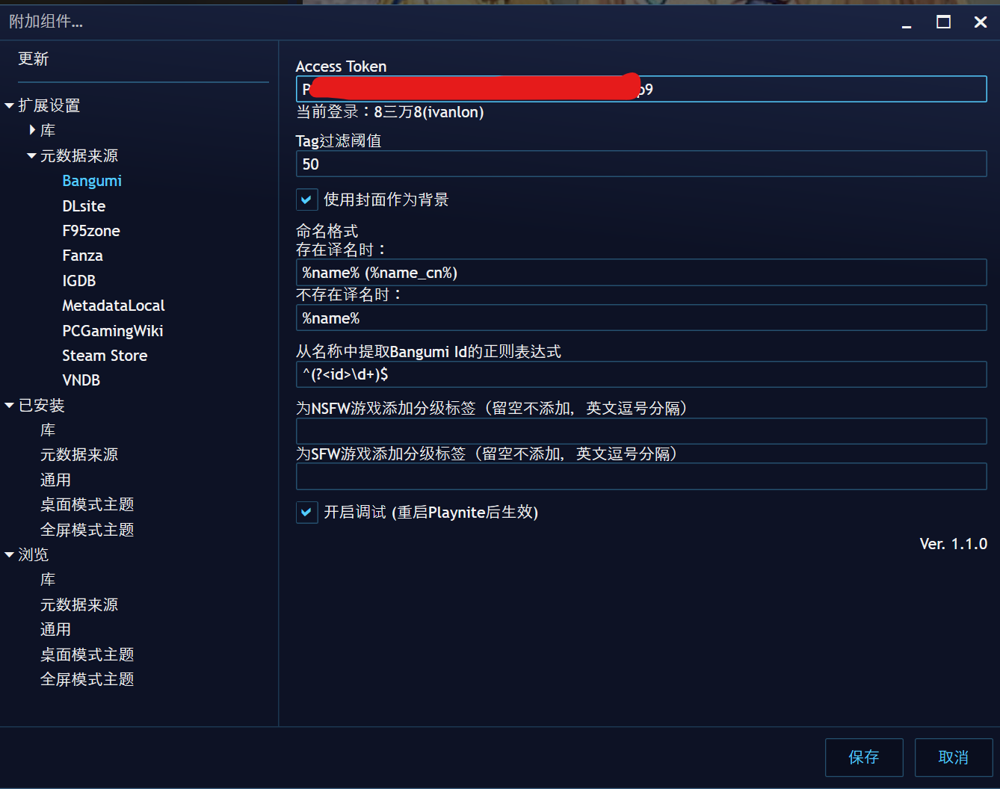

# Playnite Bangumi Metadata Provider

> [Bangumi](https://bgm.tv/)  
> [Playnite](https://playnite.link/)

Playnite的Bangumi元数据插件

## 使用方法  
1. 在[Bangumi API](https://bangumi.github.io/api/)生成一个Access Token
2. 从[Release](https://github.com/Ivanlon30000/PlayniteBangumiMetadata/releases)中下载`.pext`插件文件
3. 安装插件
4. 在Playnite的扩展设置-附加组件-元数据来源-Bangumi-Access Token中填写你的Access Token

## 提供的字段  
+ 社区评分(`CommunityScore`)  
    > Bangumi评分*10
+ 封面图像(`CoverImage`)
+ 描述(`Description`)  
+ 开发者(`Developers`)
+ 流派(`Genres`)
    > 游戏类型
+ 链接(`Links`)  
    > + Bangumi页面
    > + 游戏官网（如果有）
+ 游戏名(`Name`)  
    > 根据用户设置的格式
+ 发行者(`Publishers`)
+ 发行日期(`ReleaseDate`)
+ 标签(`Tags`)  
    > Bangumi页面中“大家将 xx 标注为”
+ 背景图片(`BackgroundImage`)  
    > 在设置中启用后，封面图片作为背景图片提供
+ 年龄分级(`AgeRating`)  
    > 在设置中启用后，为sfw/nsfw作品设置年龄分级
+ 平台(`Platform`)  

## 扩展设置

 + Access Token (可选)
 + Tag过滤阈值  
    > Bangumi中“大家把 xx 标注为”字段会被视为标签(`Tags`)，用户投票数低于阈值的tag会被忽略
 + 使用封面作为背景  
    > 不勾选时不提供背景
 + 命名格式  
   > 支持3个字段
   > 1. `%name%`: 原名
   > 2. `%name_cn%`: 译名（如果有）
   > 3. `%id`: Bangumi Subject Id
 + 从名称中提取Bangumi Id的正则表达式
   > 插件会首先尝试将游戏名称作为Bangumi Id获取游戏信息  
   > 然后根据此项设置尝试匹配Bangumi Id（需要使用id捕获组来标记id）  
   > 最后搜索游戏名
 + 为NSFW/SFW游戏添加分级标签  
 + 开启调试  
   > 开启后会将log写入`extensions.log`文件  
   > 该文件的位置在`%AppData%\Playnite`(安装版)或Playnite的安装文件夹(便携版)
   > 反馈bug时请提交该文件
 
## LICENSE  
  > MIT License
  > 
  > Copyright (c) 2023 Ivanlon
  > 
  > Permission is hereby granted, free of charge, to any person obtaining a copy
  > of this software and associated documentation files (the "Software"), to deal
  > in the Software without restriction, including without limitation the rights
  > to use, copy, modify, merge, publish, distribute, sublicense, and/or sell
  > copies of the Software, and to permit persons to whom the Software is
  > furnished to do so, subject to the following conditions:
  > 
  > The above copyright notice and this permission notice shall be included in all
  > copies or substantial portions of the Software.
  > 
  > THE SOFTWARE IS PROVIDED "AS IS", WITHOUT WARRANTY OF ANY KIND, EXPRESS OR
  > IMPLIED, INCLUDING BUT NOT LIMITED TO THE WARRANTIES OF MERCHANTABILITY,
  > FITNESS FOR A PARTICULAR PURPOSE AND NONINFRINGEMENT. IN NO EVENT SHALL THE
  > AUTHORS OR COPYRIGHT HOLDERS BE LIABLE FOR ANY CLAIM, DAMAGES OR OTHER
  > LIABILITY, WHETHER IN AN ACTION OF CONTRACT, TORT OR OTHERWISE, ARISING FROM,
  > OUT OF OR IN CONNECTION WITH THE SOFTWARE OR THE USE OR OTHER DEALINGS IN THE
  > SOFTWARE.