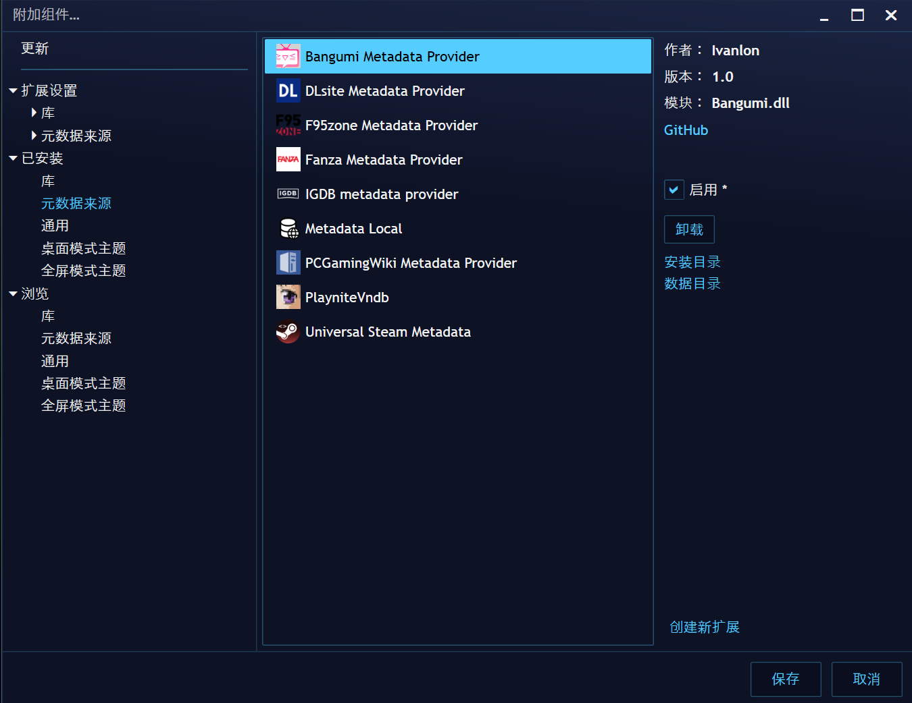
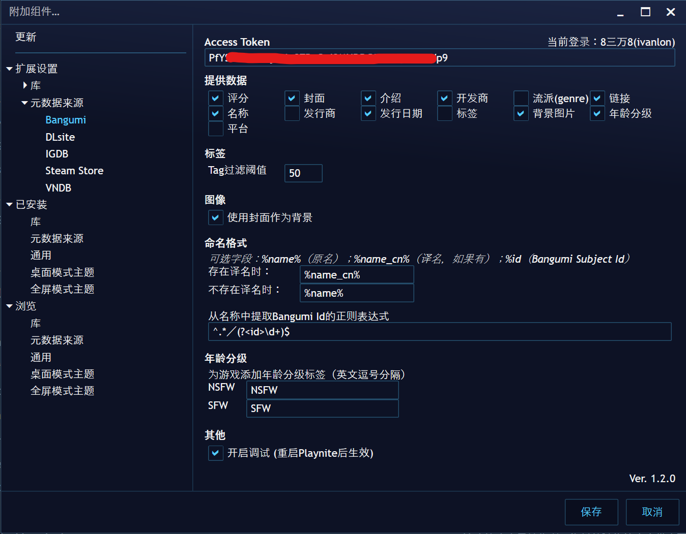

# Playnite Bangumi Metadata Provider
## 这是什么
一个 [Playnite](https://playnite.link/) 的资料数据（元数据）来源插件，可以从 [bangumi.tv](https://bgm.tv/) 获取元数据。

## 安装  
### 方法一：从 Playnite 附加组件数据库安装（推荐）
1. 在 Playnite 主界面按下 `F9` 打开附加组件
2. `浏览` -> `资料数据来源` -> `Bangumi Metadata Provider` -> `安装`

### 方法二：手动安装 `.pext` 文件
1. 从 [Release](https://github.com/Ivanlon30000/PlayniteBangumiMetadata/releases) 下载 `.pext` 插件文件
2. 打开文件 -> 同意安装

### 设置 Access Token （可选）
1. 在 [Bangumi API](https://bangumi.github.io/api/) 生成一个 Access Token
2. 在 `扩展设置` -> `资料数据来源` -> `Bangumi` -> `Access Token` 中填写你的 Access Token

#### 不设置 Access Token 可能会出现以下情况：  
1. 部分游戏搜索不到；
2. 部分游戏能够搜索到，但获取信息失败。  

> bangumi 账号注册后的一段时间之内是没有访问部分游戏信息的权限的  
> 因此新注册的账号即使配置了 Access Token，也有可能出现搜索不到部分游戏或获取信息失败的情况

## 提供的字段  
+ 社区评分(`CommunityScore`)  
    > Bangumi 评分*10
+ 封面图像(`CoverImage`)
+ 介绍(`Description`)  
+ 开发者(`Developers`)
+ 流派(`Genres`)
    > 游戏类型
+ 链接(`Links`)  
    > + Bangumi 页面
    > + 游戏官网（如果有）
+ 游戏名(`Name`)  
    > 根据用户设置的格式
+ 发行者(`Publishers`)
+ 发行日期(`ReleaseDate`)
+ 标签(`Tags`)  
    > Bangumi 页面中“大家将 xx 标注为”
+ 背景图片(`BackgroundImage`)  
    > 在设置中启用后，封面图片作为背景图片提供
+ 年龄分级(`AgeRating`)  
    > 在设置中启用后，为 SFW/NSFW 作品设置年龄分级
+ 平台(`Platform`)  

## 扩展设置

### Access Token (可选)
+ 提供数据  
> 取消勾选则不提供对应数据  

### 标签  
+ Tag 过滤阈值  
  > Bangumi 中“大家把 xx 标注为”字段会被视为标签(`Tags`)，用户投票数低于阈值的tag会被忽略

### 图像  
+ 使用封面作为背景  
  > 不勾选时不提供背景  

### 命名格式  
+ 存在/不存在译名时  
  > 游戏在 Bangumi 有没有译名，根据设置的格式提供名称  
  > 支持3个字段  
  > 1. `%name%`: 原名  
  > 2. `%name_cn%`: 译名（如果有）  
  > 3. `%id`: Bangumi Subject Id  
+ 从名称中提取 Bangumi Subject Id 的正则表达式（需要包括 `id` 捕获组）  
  > 适用于在使用 Playnite 之前已经有整理过游戏库的情况  
  > 比如 `[ALICE SOFT]ドーナドーナいっしょにわるいことをしよ[297734]`
  > 可以由正则表达式 `^.*\[(?<id>\d+)\]$` 匹配。  

  > PlayniteBangumiMetadata 按照以下顺序获取游戏信息  
  >  1. 如果 `Name` 字段是纯数字，则将其视为 Bangumi Subject Id；  
  >  2. 如果 `Name` 字段跟此正则表达式匹配，则将 `id` 捕获组中的内容视为 Bangumi Subject Id；  
  >  3. 在 bangumi.tv 搜索 `Name`，弹窗让用户选择匹配的 Bangumi Subject；  

### 年龄分级
 + 为 SFW/NSFW 游戏添加分级标签
   > 留空则不添加

### 其他
 + 开启调试  
   > 开启后会将日志写入 `extensions.log` 文件  
   > 该文件的位置在 `%AppData%\Playnite`(安装版) 或 Playnite 的安装文件夹(便携版)  
   > 反馈 bug 时请提交该文件
 
## [MIT LICENSE](https://github.com/Ivanlon30000/PlayniteBangumiMetadata/blob/master/LICENSE)
